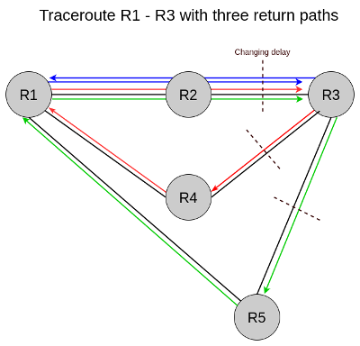

# Tartiflette_StressTesting

Pour générer des traceroutes, lancez le script "script.sh"   
python2 ./script.sh 90 30 90  
Les traceroutes seront générés sous forme de fichier json dans le dosier json.

Pour l'insertion des fichiers json dans la base mongoDB, lancez "insert.py"  
python2 ./insert.py
  
Lancez le script myRttAnalysis.py se trouvant dans tartiflette/analysis afin d'obtenir le résultat de l'analyse.

Le dossier Test_Classique permet de faire des test pour une topologie similaire

Le dossier Test_Assymétrique permet de faire des test pour une topologie avec trois chemins retours

